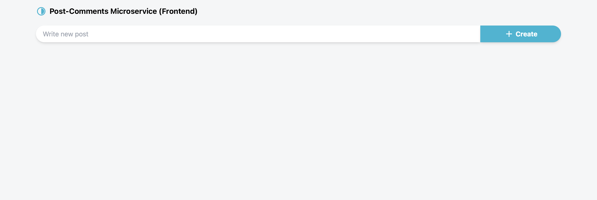
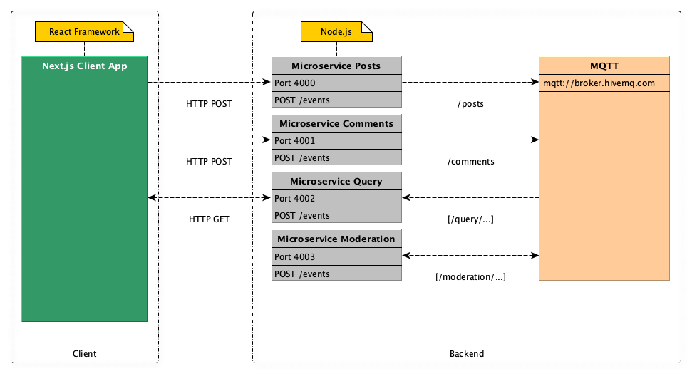
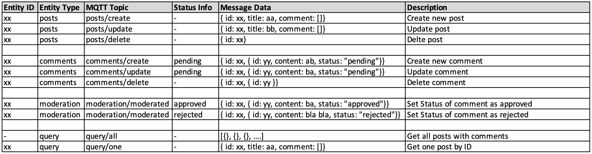

# Post and Comments App

## Microservice Architecture with Next.js, Node.js and Mqtt

Microservices have become a popular architectural pattern for building scalable and maintainable applications. In this project, we leverage Next.js for the frontend and Node.js for the backend to implement a microservices-based application. Additionally, we incorporate MQTT, the Message Queuing Telemetry Transport protocol, to enable efficient, real-time communication between microservices, making it an ideal choice for IoT applications and other scenarios where lightweight, reliable messaging is crucial.



## Features

- Frontend with Next.js: The frontend of this application is powered by Next.js, a popular React framework. Next.js provides server-side rendering, automatic code splitting, and an easy way to create dynamic, high-performance web applications.
- Backend with Node.js: Our backend services are built using Node.js, a lightweight and efficient runtime for building server-side applications. Node.js is known for its speed and scalability, making it an ideal choice for microservices.
- Microservice Architecture: We've designed this application to embrace a microservices architecture. Each microservice is responsible for a specific aspect of the application, allowing for independent development, deployment, and scaling.

## Getting Started

To get started with this project, follow these steps:

1. `npm install` in all projects (client, microservices)
2. `npm start`in all projects (client, microservices)
3. `localhost:300`to test the application

## Dependencies

### Frontend Dependencies

- **Tailwind CSS:** A utility-first CSS framework that allows you to quickly build responsive and visually pleasing user interfaces.

- **Lint:** A popular static code analysis tool for identifying and fixing problems in your JavaScript and TypeScript code.

- **SWR (Stale-While-Revalidate):** A React Hooks library for remote data fetching. SWR makes it easy to handle data loading, caching, and real-time updates.

- **React Icons:** A collection of popular icon libraries made available as React components. It simplifies the process of adding icons to your React application.

### Backend Dependencies

- **CORS (Cross-Origin Resource Sharing):** Middleware for enabling cross-origin requests. It's essential for allowing your frontend to make requests to your backend API.

- **Express:** A fast and minimalistic Node.js web application framework for building robust and scalable web applications and APIs.

- **MQTT (Message Queuing Telemetry Transport):** A lightweight, messaging protocol often used in IoT applications. It enables efficient communication between devices and services.

- **Nodemon:** A utility that automatically restarts your Node.js application when files change, making development and debugging more efficient.

## Application Structure Overview



## Event Flow (MQTT Events)



## Folder Structure

```none
nextjs13-mqtt-microservices
└── client
└── docs
└── microservices
|    ├── comments
|    ├── moderation
|    ├── posts
|    └── query
└── (...)
```
