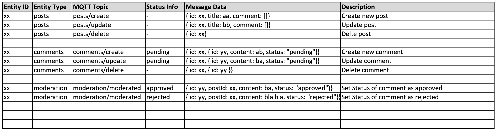

# nextjs13-mqtt-microservices

## Application Overview


## Event Flow (MQTT Events)



## Folder Structure

```none
nextjs13-mqtt-microservices
└── client
└── docs
└── microservices
|    ├── comments
|    ├── moderation
|    ├── posts
|    └── query
└── (...)
```
